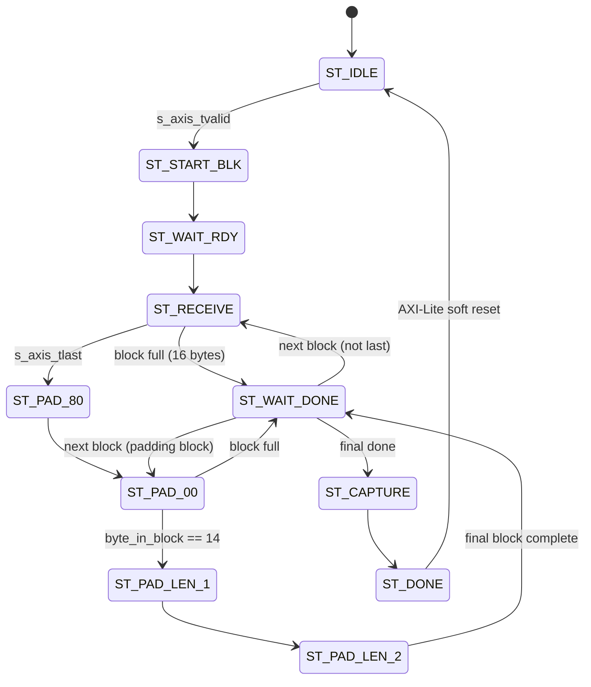

# Project History & Engineering Notes: Mini-SHA256 Stream Wrapper

This document serves as a comprehensive reference of the development history, architectural design decisions, problems encountered, and resolutions implemented during the creation of the AXI-Stream/Lite wrapper for the custom `mini_sha256_core`.

---

## 1. Project Goal & Architecture
The goal was to design and verify an IP wrapper for a customized 16-bit word size SHA-256 accelerator (`mini_sha256_core`) to make it easily integration-ready with AMD/Xilinx Vivado Block Designs (e.g., using AXI DMA from an ARM processor on a PYNQ board).

### Interface Definitions
- **AXI-Stream (Slave)**: An 8-bit wide input stream interface (`s_axis_tdata`, `s_axis_tvalid`, `s_axis_tready`, `s_axis_tlast`) to receive raw, unpadded data from a DMA controller at high throughput.
- **AXI-Lite (Slave)**: A 32-bit register read/write interface used by the CPU to poll status (`padder_done`) and read the final 128-bit hash digest (divided across four 32-bit registers).

### Internal Processing
- The wrapper contains an FSM that packs 8-bit stream bytes into 16-bit words (`core_data_in`).
- It implements the SHA-256 padding specification in hardware (appending `0x80`, zero-padding, and appending the 16-bit big-endian bit length of the input stream).
- It sequences block-by-block hashing via handshakes with `mini_sha256_core`.

---

## 2. FSM State Diagram (Conceptual)


---

## 3. Problems Faced & Solutions

### Problem 1: Core Handshake Lockup
- **Symptom**: The wrapper FSM would hang indefinitely waiting for the core to assert `core_done`.
- **Root Cause**: The core controller expects `first_block` to be asserted on the very first block, and subsequent blocks to have `first_block` deasserted. Furthermore, feeding data before the core's datapath was ready caused internal pipeline state misalignments.
- **Solution**:
  - Implemented state `ST_WAIT_RDY` to block data transfers until `core_data_rdy` is active.
  - Set `core_first_block <= 1` at start, latching it to `0` once `byte_in_block == 15` (the end of the first block).

### Problem 2: Exact Padding Block Overflow
- **Symptom**: For specific message sizes (e.g., 55 bytes), the simulation timed out or produced corrupted hashes because the state machine failed to cross block boundaries during padding.
- **Root Cause**: When the padding logic reached byte 15 of a block in `ST_PAD_00`, it kept pushing data without pausing for the core to finish processing the block currently in its buffer.
- **Solution**:
  - Added transition check in `ST_PAD_00`:
    ```verilog
    if (byte_in_block == 15) begin
        core_first_block <= 0;
        next_state_after_done <= ST_PAD_00; // Return to zero padding after wait
        p_state <= ST_WAIT_DONE;
    end
    ```
  - This ensures that the core computes the hash of the current block before the wrapper attempts to stream zero-bytes of the next padding block.

### Problem 3: Test 2 Hash Mismatch (Testbench Bug)
- **Symptom**: Test 2 (`"Hello World!..."`) failed simulation with hash output `2045e485...` instead of expected `0e253e5a...`.
- **Root Cause**: The string was 48 characters, but the testbench passed `len=50` to the `send_string` task. Because Verilog zero-extends string literals on the left, the testbench prepended two null bytes (`\0\0`) to the message. The hardware correctly hashed `\0\0Hello World...`, leading to a comparison mismatch.
- **Solution**: Changed the length argument in `tb_mini_sha256_stream.v` to `48`.

### Problem 4: Vivado Simulator Caching (Incremental Compilation)
- **Symptom**: Even after modifying wrapper HDL files, simulation in Vivado GUI kept running into timeouts.
- **Root Cause**: Vivado's `xvlog --incr` compiler did not register changes to the wrapper, running the stale build with the padding deadlock bug.
- **Solution**: Advised resetting the simulation cache in the GUI before restarting simulation to guarantee a clean rebuild.

---

## 4. Final Status
All 4 stream test cases pass behavioral simulation, achieving 100% correct hashing matching the Python reference implementation. The project is initialized under Git, ignored cleanly of temporary/log directories, and pushed to [github.com/Arul1006/mini_sha_pynq_2](https://github.com/Arul1006/mini_sha_pynq_2.git).
